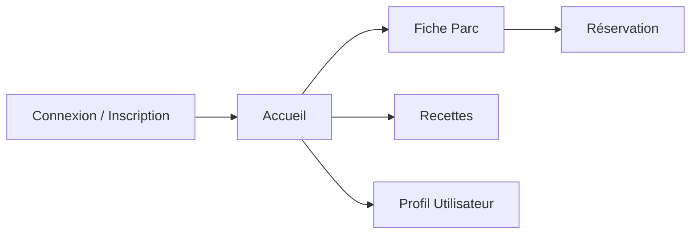

# Pique-me

Application mobile pour organiser la réservation des spots dans les parcs de Montréal.

## 1. MVP (Produit Minimum Viable)

- Consulter les parcs à Montréal
- Voir les équipements disponibles (BBQ, tables, etc.)
- Consulter la liste des activités par parc
- Réserver un emplacement / une activité
- Optionnel : afficher des recettes / réseaux sociaux
- Rechercher des parcs par nom ou équipements
- Consulter les avis des utilisateurs

## 2. Architecture & Conception

### a) Écrans à prévoir

- **Auth** : Connexion / Inscription
- **Accueil** : Liste des parcs
- **Fiche Parc** : Détails d’un parc
- **Réservation** : Sélection d’un créneau / d’une activité
- **Recettes** : Idées de recettes et partages
- **Profil** : Informations et historique utilisateur
- **Écran de recherche** : Liste des parcs et recettes favorites

### b) Composants UI

- Boutons (Call to action, navigation)
- Cartes de parc (aperçu rapide)
- Fiches recette (image + description)
- Fenêtres modales de réservation
- Barre de navigation bottom / top



## 3. Implémentation technique

### Frontend (React Native + Expo)

- Navigation entre les écrans (React Navigation)
- Gestion des formulaires (avis, signalement)
- Affichage dynamique des parcs et contenus
- Système de réservation basique

### Backend (Node.js + Express)

- Authentification utilisateur
- Base de données pour stocker:
    - Parcs et leurs équipements
    - Réservations
    - Recettes
    - Activités
- Gestion du système de réservation
- Gestion du système de notification et avis

## 4. Fonctionnalités secondaires

- Favoris (parcs, recettes)
- Notations ou avis
- Section sociale (fil de publications, commentaires, événements)

## 5. Tests

- Vérification des formulaires
- Navigation (passage d’écran)
- Affichage correct des données\ n- Validité des règles et disponibilités

## 6. Déploiement

- Tests sur Expo Go ou TestFlight
- Préparation pour publication sur les stores (iOS & Android)

# Comment exécuter

### 1. Installer les dépendances
```bash
    npm install
```

### 2.Lancer l'application

```bash
   cd PiqueMe
   npx expo start
```

Dans la sortie, vous trouverez des options pour ouvrir l'application dans un:

- [development build](https://docs.expo.dev/develop/development-builds/introduction/)
- [Android emulator](https://docs.expo.dev/workflow/android-studio-emulator/)
- [iOS simulator](https://docs.expo.dev/workflow/ios-simulator/)
- [Expo Go](https://expo.dev/go), application  pour visualiser et tester l'application directement sur mobile

# Structure de l'application

### 1. Dossier `app`
Contient la navigation de l'application, qui est basée sur les fichiers. La structure des
fichiers dans le répertoire `app` détermine la navigation de l'application.

L'application a deux routes définies par deux fichiers : `app/(tabs)/index.tsx` et
`app/(tabs)/explore.tsx`. Le fichier de mise en page `app/(tabs)/_layout.tsx` configure le
navigateur à onglets.

### 2. Dossier `assets`
Contient `adaptive-icon.png` utilisé pour Android et `icon.png` utilisé pour iOS comme icônes
de l'application.

Il contient également `splash.png`, une image pour l'écran de démarrage
du projet, et `favicon.png` si l'application s'exécute dans un navigateur.

### 3. Dossier `components`
Contient des composants React Native, comme `ThemedText.tsx`, qui crée des éléments de texte
utilisant le thème de couleurs de l'application en modes clair et sombre.

Tous les components de l'application doivent être dans ce dossier et seront importés
dans `app/(tabs)/_layout.tsx` pour les utiliser.

### 4. Dossier `constants`
Contient des fichiers de configuration pour l'application, comme `Colors.ts` pour les couleurs
utilisées dans l'application.

### 5. Dossier `hooks`
Contient des Hooks React, qui permettent de partager des comportements communs entre les
composants.

Par exemple, useThemeColor(), dans `useThemeColor.ts`, est un hook qui retourne une couleur en
fonction du thème actuel.

### 6. Dossier `scripts`
Contient `reset-project.js`, qui peut être exécuté avec

```bash 
    npm run reset-project
```

Ce script déplacera
le répertoire `app` vers `app-example` et créera un nouveau répertoire `app` avec un fichier `index.tsx`.
On va l'utiliser plus tard pour commencer le projet à partir de zéro.

### 7. Fichier `app.json`
Contient la configuration de l'application, comme le nom, l'icône et les paramètres de l'écran de démarrage...


Ces options modifient le comportement du projet lors du développement, de la construction, de la
soumission et de la mise à jour de l'application.

### 8. Fichier `package.json`
Le fichier `package.json` contient les dépendances, les scripts et les métadonnées du projet.
Chaque fois qu'une nouvelle dépendance est ajoutée au projet, elle sera ajoutée à ce fichier.

### 9. Fichier `tsconfig.json`
Contient les règles que TypeScript utilisera pour appliquer la sécurité des types dans tout le projet.

> #### Plus de documentation sur _[Expo](https://docs.expo.dev/get-started/set-up-your-environment/)_