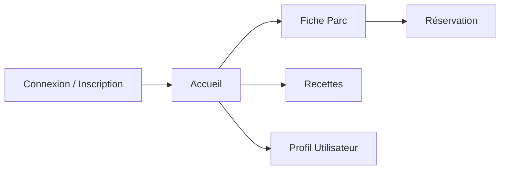

# Pique-me

Application mobile pour organiser la réservation des spots dans les parcs de Montréal.

## 1. MVP (Produit Minimum Viable)

- Consulter les parcs à Montréal
- Voir les équipements disponibles (BBQ, tables, etc.)
- Consulter la liste des activités par parc
- Réserver un emplacement / une activité
- Optionnel : afficher des recettes / réseaux sociaux
- Rechercher des parcs par nom ou équipements
- Consulter les avis des utilisateurs

## 2. Architecture & Conception

### a) Écrans à prévoir

- **Auth** : Connexion / Inscription
- **Accueil** : Liste des parcs
- **Fiche Parc** : Détails d’un parc
- **Réservation** : Sélection d’un créneau / d’une activité
- **Recettes** : Idées de recettes et partages
- **Profil** : Informations et historique utilisateur
- **Écran de recherche** : Liste des parcs et recettes favorites

### b) Composants UI

- Boutons (Call to action, navigation)
- Cartes de parc (aperçu rapide)
- Fiches recette (image + description)
- Fenêtres modales de réservation
- Barre de navigation bottom / top



## 3. Implémentation technique

### Frontend (React Native + Expo)

- Navigation entre les écrans (React Navigation)
- Gestion des formulaires (avis, signalement)
- Affichage dynamique des parcs et contenus
- Système de réservation basique

### Backend (Node.js + Express)

- Authentification utilisateur
- Base de données pour stocker:
  - Parcs et leurs équipements
  - Réservations
  - Recettes
  - Activités
- Gestion du système de réservation
- Gestion du système de notification et avis

## 4. Fonctionnalités secondaires

- Favoris (parcs, recettes)
- Notations ou avis
- Section sociale (fil de publications, commentaires, événements)

## 5. Tests

- Vérification des formulaires
- Navigation (passage d’écran)
- Affichage correct des données\ n- Validité des règles et disponibilités

## 6. Déploiement

- Tests sur Expo Go ou TestFlight
- Préparation pour publication sur les stores (iOS & Android)

```bash
cd rapport
```
