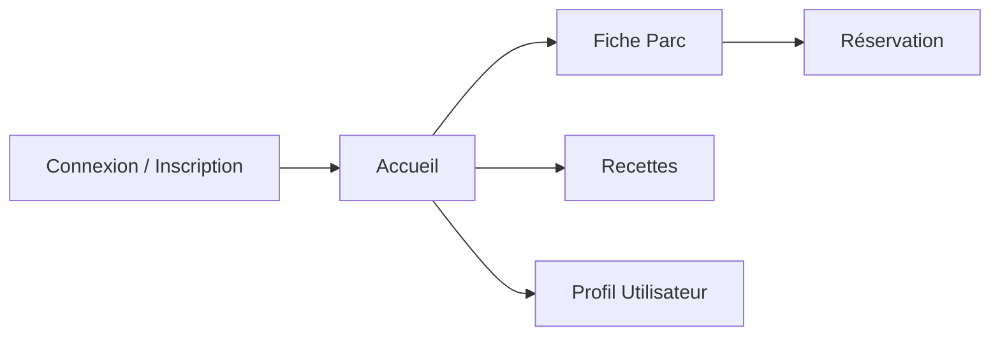

# Pique-me

Application mobile pour organiser la réservation des spots dans les parcs de Montréal.

## 1. MVP (Produit Minimum Viable)

- Consulter les parcs à Montréal
- Voir les équipements disponibles (BBQ, tables, etc.)
- Consulter la liste des activités par parc
- Réserver un emplacement / une activité
- Optionnel : afficher des recettes / réseaux sociaux

## 2. Architecture & Conception

### a) Écrans à prévoir

- **Auth** : Connexion / Inscription
- **Accueil** : Liste des parcs
- **Fiche Parc** : Détails d’un parc
- **Réservation** : Sélection d’un créneau / d’une activité
- **Recettes** : Idées de recettes et partages
- **Profil** : Informations et historique utilisateur

### b) Composants UI

- Boutons (Call to action, navigation)
- Cartes de parc (aperçu rapide)
- Fiches recette (image + description)
- Fenêtres modales de réservation
- Barre de navigation bottom / top

